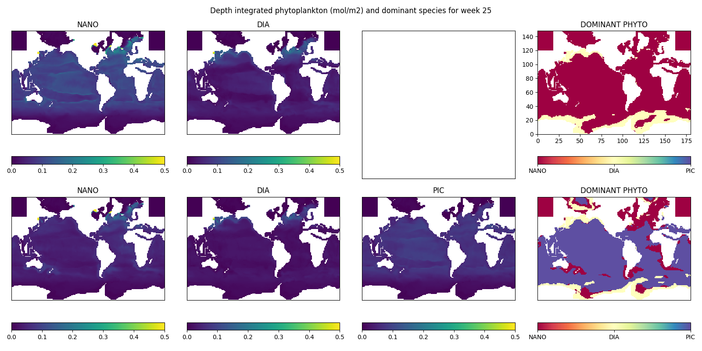

# About

NEMO Version 5.0 Biogeochemistry Demonstrator


## Description

This test case provides a demonstration of PISCES, the biogeochemical (BGC) model included within NEMO V5.0, over the full global ocean. Provided with this test case are scripts for determining the dominant phytoplankton and zooplankton at each grid point in the global ocean for two reference runs, one based on the PISCES (P4Z) configuration and one based on the PISCES QUOTA (P5Z) configuration. 

This demonstrator helps to educate new users of NEMO interested in running with BGC on the changes necessary to run the different configurations of PISCES. Comparison of the outputs from each run also allows to explore the effect of having a higher complexity model (through the additional phytoplankton included within PISCES QUOTA) and the impact this has on the dominance of each plankton type.


## Background

PISCES is a biogeochemical model that simulates marine biological productivity and describes the biogeochemical cycles of carbon and five nutrients (nitrates, ammonium, phosphate, silicate, and iron). The model represents four living pools: two phytoplankton size classes (nanophytoplankton and diatoms) and two zooplankton size classes (microzooplankton and mesozooplankton), and three non-living compartments: semi-labile dissolved organic matter, and small and big sinking particles. Nutrients are supplied to the ocean from three sources: atmospheric dust, rivers, and sediment, and phytoplankton growth is limited by the availability of each nutrient.

<div align="center">
  
</div>

The PISCES QUOTA model builds upon the standard operational version of PISCES to include a quota-based description of phytoplankton growth with fully variable C:N:P:Si:Fe:Chl ratios. The basic structure of the model is also modified with the addition of a third phytoplankton group, picophytoplankton.

<div align="center">
  
</div>


## Getting Started
### Dependencies

The following dependencies are required for this demonstrator:
* NetCDF package installed on your HPC
* XIOS package installed on your HPC
* An arch file for your HPC (which sets the paths for XIOS, NetCDF, and the compiler)
* An install of ImageMagick (for converting images to animations)
* An install of Python version 3.8 or above
* Installs of the following Python packages:
  * numpy, pandas, netCDF4, matplotlib, xarray, sys

### Provided files

To be able to run the demonstrator, the directory `PISCES_FILES` has the `namelist` reference and configuration files needed for running PISCES. The directories `P4Z_FILES` and `P5Z_FILES` also include the following files specific to each configuration:
* `namelist_pisces_ref` set to run the specific configuration
* `namelist_top_cfg` with the specific parameter values for each configuration
* `file_def_nemo_pisces.xml` with the required variables for each reference run

We also include the following files for post-processing of the outputs in the directory `SCRIPTS`:
* A `mesh_mask_v5.nc` file for use with NEMO V5.0
* `models.csv` which lists details for the models we are comparing
* A shell script `compare.sh` to visualise the comparison of the dominant species for each run
* Python scripts `dominant-phyto.py` and `dominant-zoo.py` to calculate the dominant phyto- and zooplankton, respectively, at each grid point
* A python script `summary.py` to generate a global average summary of each plankton type for comparison


### Installing

Details for installing NEMO V5.0 can be found [here](https://sites.nemo-ocean.io/user-guide/install.html#download-and-install-the-nemo-code). The suggested method is to clone the repository using the command
```
git clone --branch 5.0 https://forge.nemo-ocean.eu/nemo/nemo.git nemo_5.0
```
but it is also possible to download a tarball or zipfile of the code.

Once the code has been downloaded, we need to compile the model. The `arch` directory contains the settings for compiling the model, together with several example architecture files. You can use these example files to create your own architecture file (which we will call simply `arch.fcm`) with the relevant paths for the XIOS and NetCDF packages on your computer or HPC environment.

Our demonstrator is based on the [ORCA2_ICE_PISCES](https://sites.nemo-ocean.io/user-guide/cfgs.html#orca2-ice-pisces) reference configuration. We build our new `BGC_DEMO` configuration by duplicating the reference configuration with the command
```
./makenemo –n 'BGC_DEMO' -r 'ORCA2_ICE_PISCES' -m arch.fcm
```

### Running each configuration of PISCES

In your work directory (which we will refer to as simply `$WORK`), create the directory `BGC_DEMO_RUN` for running the demonstrator. You should then create two additional directories `$WORK/BGC_DEMO_RUN/P4Z` and `$WORK/BGC_DEMO_RUN/P5Z`, where we will run each configuration of PISCES. Copy the files from `BGC_DEMO_FILES` into each directory, and then copy the files specific to each configuration:
```
cp BGC_DEMO/PISCES_FILES/* $WORK/BGC_DEMO_RUN/P4Z/
cp BGC_DEMO/P4Z_FILES/* $WORK/BGC_DEMO_RUN/P4Z/

cp BGC_DEMO/PISCES_FILES/* $WORK/BGC_DEMO_RUN/P5Z/
cp BGC_DEMO/P5Z_FILES/* $WORK/BGC_DEMO_RUN/P5Z/
```

We note here the main differences between the two configurations. The version of model to use is set in `namelist_pisces_ref`:
```
!-----------------------------------------------------------------------
&nampismod     !  Model used 
!-----------------------------------------------------------------------
  ln_p2z      = .false.      !  LOBSTER model used
  ln_p4z      = .true.       !  PISCES model used
  ln_p5z      = .false.      !  PISCES QUOTA model used
```
and we set the tracers for the run in `namelist_top_ref` and `namelist_top_cfg`. P4Z uses 24 tracers, while P5Z has 40 tracers:
```
!-----------------------------------------------------------------------
&namtrc          !   tracers definition
!-----------------------------------------------------------------------
   jp_bgc        =  40
```
Finally, we set the variables to be output in `file_def_nemo-pisces.xml`:
```
  <!-- ln_p4z variables -->
  <field field_ref="PHY"                             />
  <field field_ref="PHY2"                            />
  <field field_ref="ZOO"                             />
  <field field_ref="ZOO2"                            /> 

  <!-- ln_p5z variables -->
  <field field_ref="PHY"                             />
  <field field_ref="PHY2"                            />
  <field field_ref="PIC"                             />
  <field field_ref="ZOO"                             />
  <field field_ref="ZOO2"                            /> 
```

Our demonstrator uses the [ORCA2_ICE_v5.0.0.tar.gz](https://gws-access.jasmin.ac.uk/public/nemo/sette_inputs/) inputfiles, which should be downloaded and copied into each run directory.

To run the model, copy the executable into each run directory and then submit:
```
cp nemo-5.0/cfgs/BGC_DEMO/BLD/bin/nemo.exe .
./nemo.exe

```
The model runs over the full global ocean for one year (1948) with a timestep of `5400s` and outputs at a 7-day time frequency. When the model has finished, it will output a file `ORCA2_7d_19480101_19481231_ptrc_T.nc` with the concentrations for each phyto- and zooplankton.


## Results

We describe here the steps for running the scripts to visualise the difference in dominant species between each configuration of PISCES. The first step is to copy the scripts from the directory `SCRIPTS` into your `$WORK/BGC_DEMO_RUN` directory. We then need to update the `models.csv` file to include the correct directory location for your `$WORK` directory.

We run the comparison with the command `./compare.sh`, which will run a series of python scripts to:
* calculate depth-averaged values for each phyto- and zooplankton
* determine the dominant species at each grid point for each reference run. This will be contained in the following files, saved in the run directory:
  * `ORCA2_7d_19480101_19481231_domphy_T.nc`
  * `ORCA2_7d_19480101_19481231_domzoo_T.nc`
* generate comparison images of the dominant phyto- and zooplankton for each configuration
* combine these images into a single animation for each plankton type (named `DOMPHY.gif` and `DOMZOO.gif`, respectively)

The script will output the current week as it runs to show progression. An example comparing the dominant phytoplankton for a particular week is shown below:

<div align="center">
  
</div>

A script is also included to calculate the global average value for each plankton type and then plot a comparison between the two configurations. This is run with the command `./summary.py`, with an example of the output shown below:

<div align="center">
  
</div>


## Authors

Contributors:
* Philip Townsend
* Renaud Person
* Julien Palmieri  

